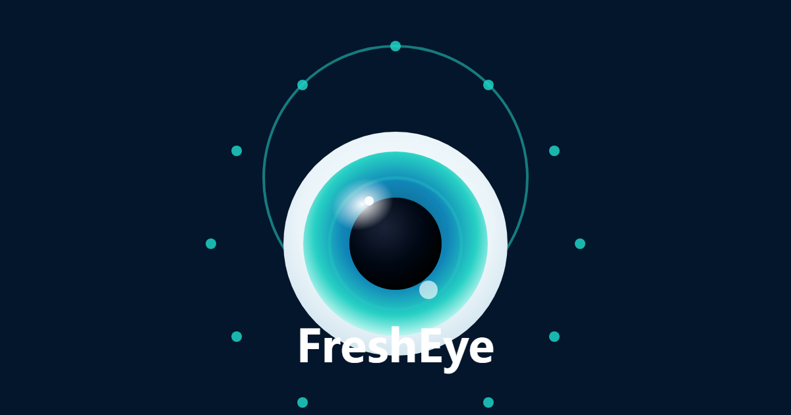

<div align="center">


# 鲜眸 · FreshEye · 水产品新鲜度智能评估系统

**一拍知鲜 · 吃得放心** — 基于 FishFreshNet CNN 的鱼眼新鲜度智能识别

[](LICENSE)
[](#models)
[](#models)
[](#architecture)
[](#architecture)
[](#key-features)

**在线体验**：前端 [GitHub Pages](https://fresheye.yance777.com/) · 后端 [Hugging Face Spaces](https://huggingface.co/spaces/andreas777/fresheye)



> 🐟 使用 **TRAE IDE** 全程开发 · TRAE AI 创造力大赛 · 社会服务赛道 · 作者：祈雨柒

</div>

## 中文摘要

FreshEye 是一个基于鱼眼照片的水产品视觉新鲜度辅助评估系统：上传一张鱼眼照片，获得三级视觉分类、MFED 测试集最高 99.29% 的模型验证结果、置信度、Grad-CAM 判断依据、处理建议与可追溯报告。

**核心链路**：上传 → AI 分析 → Grad-CAM → 结果与建议。报告仅描述视觉特征，不替代法定食品检测、质量合格证明或食用安全判断。

**[在线体验](https://fresheye.yance777.com/)** · **[技术细节](frontend/about.html)** · **[公开数据集](https://data.mendeley.com/datasets/67nmx3mhwh/2)**

---

> [English](#english) | [中文](#中文) | [核心能力](#核心能力) | [检测流程](#检测流程) | [架构](#架构) | [模型](#模型) | [部署](#部署) | [仓库结构](#仓库结构)

---

<a id="english"></a>

## English

鲜眸 (FreshEye) is an AI-powered aquatic product freshness assessment system. Using fish-eye images as the core input, it combines the **FishFreshNetV1/V2** lightweight CNN models, **Grad-CAM** explainability analysis, and **confidence-adaptive interaction** to output freshness grade, confidence, visual evidence, structured reports, and handling recommendations.

<a id="key-features"></a>

### Key Features

- 🐟 **CNN Inference** — judges fish-eye freshness with FishFreshNetV1/V2 (no LLM dependency).
- 🎯 **Three-class classification** — Highly Fresh / Fresh / Not Fresh.
- 🔄 **Dual-model routing** — switch between V1 (EfficientNet-B0 + CBAM) and V2 (EfficientNet-B0 + ECA + Light CRA) in the frontend.
- 🔥 **Grad-CAM explainability** — heatmaps reveal the regions the model focuses on.
- 🚦 **Confidence-adaptive interaction** — green/yellow/red dashboard with retake prompts for low-confidence results.
- 📊 **Structured analysis** — rule-based eye appearance / clarity / color / texture / quality descriptions.
- 📋 **Five-category recommendations** — storage / consumption / handling / safety / best practices.
- 📄 **PDF report export** — original image, heatmap, probability distribution, and detailed analysis.
- 📱 **PWA support** — offline caching with Service Worker, plus an in-app camera viewfinder with a circular fish-eye guide frame on mobile.
- 🧠 **MFED dataset** — 4800+ samples, 4 environments, 2 fish species, open-sourced on Mendeley Data.

<a id="detection-workflow"></a>

### Detection Workflow

```text
image_upload (click / drag / paste / camera)
  -> format_validation (JPG/PNG/WebP, max 25MB)
  -> quality_reject (unsupported format / oversize -> retry)
  -> image_preprocess (auto-compress large images, max 1280px)
  -> api_request (POST /predict_with_gradcam?model_version=v1|v2)
  -> cnn_classification (FishFreshNetV1/V2 inference -> 3-class probabilities)
  -> confidence_display (>= 80% high / 60-80% mid / < 60% low + retake prompt)
  -> gradcam_visualization (gradient-weighted class activation mapping)
  -> probability_output (three-class probability distribution)
  -> structured_analysis (rule-based eye appearance / clarity / color / texture / quality)
  -> recommendation_generation (five-category rule templates)
  -> result_visualization (dashboard / probability bar / heatmap slider / 4-tab report)
  -> export_and_history (PDF export + localStorage history)
  -> END
```

<a id="architecture"></a>

### Architecture

| Part | Stack | Highlights |
| :--- | :--- | :--- |
| Frontend | Pure HTML/CSS/JS + PWA | Deployed on GitHub Pages, no build step required |
| Backend | FastAPI + PyTorch + OpenCV | Deployed on Hugging Face Spaces via Docker |
| Model | FishFreshNetV1 / FishFreshNetV2 | In-process CNN inference with Grad-CAM |

The frontend performs format validation, image compression, and confidence-adaptive rendering; the backend performs CNN inference and Grad-CAM heatmap generation. No external model service or LLM is required.

<a id="models"></a>

### Models

| Model | Architecture | Parameters | Accuracy | Key Innovation |
| :--- | :--- | :--- | :--- | :--- |
| **FishFreshNetV1** | EfficientNet-B0 + CBAM | 4.216M | 98.88% | CBAM channel + spatial attention |
| **FishFreshNetV2** | EfficientNet-B0 + ECA + Light CRA | 4.095M | **99.29%** | Light CRA (ring-mask + shared conv) + ECA |

Both models are trained on the **MFED** dataset (4800+ samples, 4 environments, 2 fish species), open-sourced on [Mendeley Data](https://data.mendeley.com/).

<a id="deployment"></a>

### Deployment

- **Frontend**: automatically deployed to GitHub Pages by `.github/workflows/deploy.yml` on every push to `main`.
- **Backend**: containerized with `deploy/Dockerfile` and deployed on Hugging Face Spaces.
- **Model weights**: place `fishfreshnet_v1.pth` and `fishfreshnet_v2.pth` under `deploy/src/storage/` (gitignored, not included in the repository).
- **Environment variables**: `V1_MODEL_PATH`, `V2_MODEL_PATH`, `PORT`, `CORS_ORIGINS`, `FISHFRESHNET_MAX_IMAGE_MB`.

<a id="repository-structure"></a>

### Repository Structure

```text
FreshEye/
├── deploy/                     # Production backend (FastAPI + PyTorch, HF Spaces)
│   ├── app.py                  # API: /predict, /predict_with_gradcam, /health
│   ├── src/
│   │   ├── fishfreshnet_v2_model.py  # V2 model architecture
│   │   └── storage/            # Model weights (gitignored)
│   ├── Dockerfile
│   ├── requirements.txt
│   └── test_app.py
├── frontend/                   # Production frontend (GitHub Pages)
│   ├── index.html              # Main analysis page
│   ├── about.html              # Tech architecture & model details
│   ├── fish.html               # Fish encyclopedia
│   ├── guide.html              # User guide
│   ├── 404.html
│   └── assets/                 # CSS, JS, Service Worker, samples
├── docs/                       # Model integration guide & banner
├── .github/workflows/deploy.yml
├── AGENTS.md                   # Agent navigation guide
└── LICENSE
```

<a id="documentation"></a>

### Documentation

| File | Description |
| :--- | :--- |
| [`deploy/README.md`](deploy/README.md) | Backend API & deployment guide |
| [`docs/FishFreshNetV1_Integration_Guide.md`](docs/FishFreshNetV1_Integration_Guide.md) | Model & API integration guide |
| [`AGENTS.md`](AGENTS.md) | Repository navigation guide |

### License

MIT License — see [LICENSE](LICENSE).

---

<a id="中文"></a>

## 中文

鲜眸（FreshEye）是一个基于 AI 的水产品新鲜度智能评估系统。系统以鱼眼图像为核心输入，结合 **FishFreshNetV1/V2** 轻量化 CNN 模型、**Grad-CAM** 可解释性分析和**置信度自适应交互**，输出新鲜度等级、置信度、视觉依据、结构化报告和处理建议。

<a id="核心能力"></a>

### 核心能力

| 能力 | 说明 |
| :--- | :--- |
| 🐟 **CNN 推理** | 使用 FishFreshNetV1/V2 判断鱼眼新鲜度（不依赖大语言模型） |
| 🎯 **三分类** | 高度新鲜 / 新鲜 / 不新鲜 |
| 🔄 **双模型路由** | V1（EfficientNet-B0 + CBAM）与 V2（EfficientNet-B0 + ECA + Light CRA）前端可切换 |
| 🔥 **Grad-CAM** | 热力图展示模型关注的区域，决策透明可解释 |
| 🚦 **置信度自适应** | 绿 / 黄 / 红三色仪表盘，低置信度时提示重拍 |
| 📊 **结构化分析** | 规则模板：鱼眼外观 / 清澈度 / 颜色 / 纹理 / 质量指标 |
| 📋 **五大类建议** | 储存 / 食用 / 加工 / 安全 / 最佳实践 |
| 📄 **PDF 报告** | 含原图、热力图、概率分布和详细分析 |
| 📱 **PWA 支持** | Service Worker 离线缓存 + 手机端拍照取景框（圆形鱼眼引导） |
| 🧠 **MFED 数据集** | 4800+ 样本、4 种环境、2 种鱼类，开源至 Mendeley Data |

<a id="检测流程"></a>

### 检测流程

```text
图片上传（点击 / 拖拽 / 粘贴 / 拍照）
  -> 格式校验（JPG/PNG/WebP，最大 25MB）
  -> 不合格提示（格式不支持 / 文件过大 -> 重新上传）
  -> 图像预处理（大图自动压缩，最长边 1280px）
  -> API 请求（POST /predict_with_gradcam?model_version=v1|v2）
  -> CNN 分类（FishFreshNetV1/V2 推理 -> 三分类概率）
  -> 置信度展示（>= 80% 高 / 60-80% 中 / < 60% 低 + 重拍提示）
  -> Grad-CAM 可视化（梯度加权类激活映射）
  -> 概率输出（三分类概率分布）
  -> 结构化分析（规则模板：鱼眼外观 / 清澈度 / 颜色 / 纹理 / 质量）
  -> 建议生成（五大类规则模板）
  -> 结果可视化（仪表盘 / 概率条 / 热力图滑块 / 4-Tab 报告）
  -> 导出与记录（PDF 导出 + localStorage 历史记录）
  -> END
```

<a id="架构"></a>

### 架构

| 部分 | 技术栈 | 说明 |
| :--- | :--- | :--- |
| 前端 | 纯 HTML/CSS/JS + PWA | 部署于 GitHub Pages，无需构建步骤 |
| 后端 | FastAPI + PyTorch + OpenCV | 通过 Docker 部署于 Hugging Face Spaces |
| 模型 | FishFreshNetV1 / FishFreshNetV2 | 进程内 CNN 推理 + Grad-CAM |

前端负责格式校验、图片压缩和置信度自适应渲染；后端负责 CNN 推理与 Grad-CAM 热力图生成。整个系统不依赖外部模型服务或大语言模型。

<a id="模型"></a>

### 模型

| 模型 | 架构 | 参数量 | 准确率 | 核心创新 |
| :--- | :--- | :--- | :--- | :--- |
| **FishFreshNetV1** | EfficientNet-B0 + CBAM | 4.216M | 98.88% | CBAM 通道 + 空间注意力 |
| **FishFreshNetV2** | EfficientNet-B0 + ECA + Light CRA | 4.095M | **99.29%** | Light CRA（环形掩码 + 共享卷积）+ ECA |

两个模型均在 **MFED** 数据集（4800+ 样本、4 种环境、2 种鱼类）上训练，已开源至 [Mendeley Data](https://data.mendeley.com/)。

<a id="部署"></a>

### 部署

- **前端**：每次推送至 `main` 分支时，由 `.github/workflows/deploy.yml` 自动部署到 GitHub Pages。
- **后端**：使用 `deploy/Dockerfile` 容器化，部署于 Hugging Face Spaces。
- **模型权重**：将 `fishfreshnet_v1.pth` 与 `fishfreshnet_v2.pth` 放入 `deploy/src/storage/`（已被 gitignore，不随仓库分发）。
- **环境变量**：`V1_MODEL_PATH`、`V2_MODEL_PATH`、`PORT`、`CORS_ORIGINS`、`FISHFRESHNET_MAX_IMAGE_MB`。

<a id="仓库结构"></a>

### 仓库结构

```text
FreshEye/
├── deploy/                     # 生产后端（FastAPI + PyTorch，HF Spaces）
│   ├── app.py                  # API：/predict、/predict_with_gradcam、/health
│   ├── src/
│   │   ├── fishfreshnet_v2_model.py  # V2 模型架构
│   │   └── storage/            # 模型权重（gitignored）
│   ├── Dockerfile
│   ├── requirements.txt
│   └── test_app.py
├── frontend/                   # 生产前端（GitHub Pages）
│   ├── index.html              # 主分析页
│   ├── about.html              # 技术架构与模型详情
│   ├── fish.html               # 鱼种百科
│   ├── guide.html              # 使用指南
│   ├── 404.html
│   └── assets/                 # CSS、JS、Service Worker、示例图
├── docs/                       # 模型集成指南与横幅
├── .github/workflows/deploy.yml
├── AGENTS.md                   # Agent 导航指引
└── LICENSE
```

### 文档

| 文件 | 说明 |
| :--- | :--- |
| [`deploy/README.md`](deploy/README.md) | 后端 API 与部署指南 |
| [`docs/FishFreshNetV1_Integration_Guide.md`](docs/FishFreshNetV1_Integration_Guide.md) | 模型与 API 集成指南 |
| [`AGENTS.md`](AGENTS.md) | 仓库导航指引 |

### 许可协议

MIT License — 详见 [LICENSE](LICENSE)。

---

<div align="center">

**鲜眸 · FreshEye** · 一拍知鲜，吃得放心 🐟

Made with TRAE IDE · TRAE AI Creativity Competition · Social Service Track

</div>
